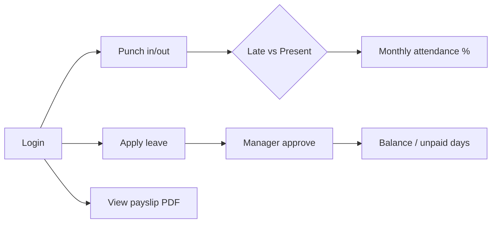
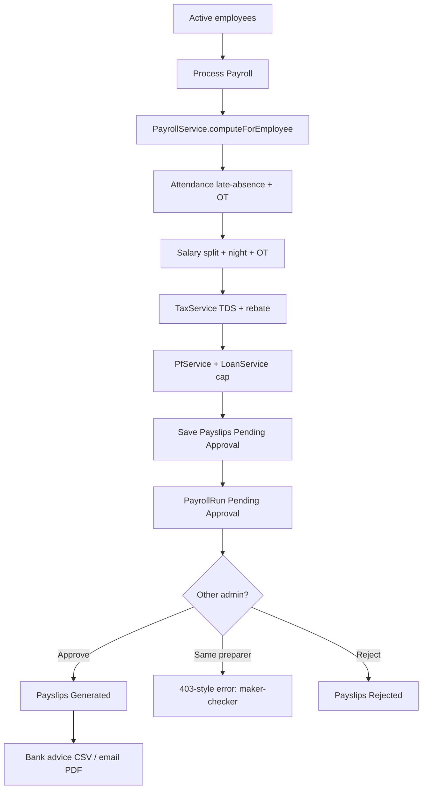
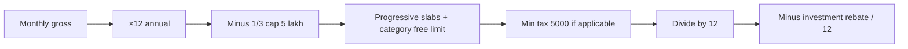
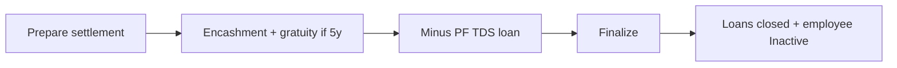
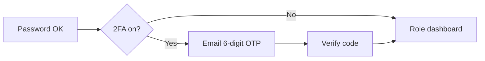

# HR Payroll — Internship / Practicum Defense Guide

Use this file during viva. If a board member asks **“ei jinish tar logic koi?”**, jump to [Section 5](#5-feature-map--logic-koi). If they ask **“same feature implement korte hole ki ki file?”**, use [Section 6](#6-how-to-implement-a-similar-new-feature).

---

## 1. One-minute project pitch

**HR Payroll** is a role-based HR & Payroll Management System for Bangladesh organizations (BDT, NBR tax, PF, 26 working days).

| Actor | What they do |
|---|---|
| **Employee** | Punch attendance, apply leave / OT / shift swap, view payslip PDF, upload documents & investment proofs, ask HR queries, enable 2FA |
| **Manager** | See own team, approve leave & overtime (department-scoped), view team attendance and reports |
| **Admin / HR** | Employees, roster, biometrics, **run payroll**, maker-checker approval, bank advice CSV, NBR tax & PF, loans, bonus, settlement, reports, audit |

**Highlight feature (likely the main viva topic):** Dynamic Payroll Engine — salary split, overtime, night differential, **NBR TDS**, PF, investment rebate, **3-late = 1 absence** deduction, unpaid leave, **loan salary protection**, then maker-checker approval. Payslips are **not auto-paid**; an approver who is **not** the preparer must approve.

**Stack:** Laravel 12, PHP 8.2+, Blade + Bootstrap 5, Vite, vanilla JavaScript, Chart.js, MySQL, `barryvdh/laravel-dompdf`.

---

## 2. How a request travels (say this in viva)

```
Browser
  → public/index.php
  → bootstrap/app.php          (middleware alias: role; web group: locale)
  → Modules/{Name}/Routes/web.php
  → Form Request (validation) — where used
  → Controller (HTTP only)
  → Service (business logic) + Model (database)
  → Notification / redirect / PDF / CSV
  → resources/views/*.blade.php
```

**Important sentence for the board:**

> Controllers handle HTTP. Business logic lives in `Modules/*/Services` (aliased from `app/Services`). Data lives in `app/Models`. Routes live in `Modules/*/Routes`. Views live in `resources/views`.

`routes/web.php` is almost empty (dashboard redirect + admin profile). Modules are registered in `app/Providers/ModuleServiceProvider.php`. Each module’s `module.json` lists a `*ServiceProvider` that extends `Modules/Support/BaseModuleServiceProvider.php` and loads that module’s `Routes/web.php`.

---

## 3. Project file structure (what lives where)

```
hrpayroll-jannat/
├── app/                          # Shared domain
│   ├── Console/Commands/         # attendance:refresh
│   ├── Http/
│   │   ├── Controllers/          # Thin leftovers / ProfileController
│   │   ├── Middleware/           # role, locale
│   │   └── Requests/             # LoginRequest (throttle)
│   ├── Models/                   # Eloquent (User, Payslip, LeaveRequest…)
│   ├── Providers/
│   │   ├── AppServiceProvider.php
│   │   └── ModuleServiceProvider.php   # ★ reads Modules/*/module.json
│   ├── Services/                 # Thin aliases → Modules/*/Services
│   ├── Support/                  # HolidayCalendar, RoleRedirector
│   └── helpers.php               # money() → ৳, status_badge()
│
├── Modules/                      # Feature modules (routes + controllers + real services)
│   ├── Auth/                     # Login, 2FA OTP, password reset
│   ├── Organization/             # Companies, branches, employees, depts
│   ├── Attendance/               # Punch, roster, shifts, biometrics, swaps
│   ├── Leave/                    # Leave / OT apply + manager approve + policies
│   ├── Payroll/                  # ★ CORE: salary, tax, PF, loans, bonus, settlement
│   ├── HR/                       # Documents, investments, appraisals, AI queries
│   ├── Analytics/                # Dashboards, reports, attrition risk
│   ├── Site/                     # Public marketing site + product catalog
│   └── Support/                  # BaseModuleServiceProvider (not a user feature)
│
├── bootstrap/app.php             # Middleware aliases
├── config/                       # holidays.php, database, auth…
├── database/
│   ├── migrations/               # Table schemas
│   └── seeders/                  # Demo users + NBR slabs + payroll settings
├── public/                       # Web root (index.php)
├── resources/
│   ├── css/app.css               # Sidebar + app shell
│   ├── js/app.js                 # Sidebar toggle, Chart.js, session warn
│   └── views/                    # Blade UI (admin / manager / employee / site)
├── routes/                       # web.php almost empty; api.php empty (modules load API)
├── tests/Feature/                # Auth / profile tests
└── DEFENSE.md                    # This file
```

### `app/` vs `Modules/` — viva answer

| Question | Answer |
|---|---|
| Why both? | **Modules** = HTTP (routes + controllers) **and** the real service classes. **`app/Models`** = shared Eloquent. **`app/Services`** = `@deprecated` subclasses so old `use App\Services\PayrollService` still works. |
| Where is payroll math? | `Modules/Payroll/Services/PayrollService.php` — **not** in the Blade or controller. |
| Where is the “Process Payroll” button handled? | `Modules/Payroll/Http/Controllers/PayrollController.php` → `processPayroll()` |

---

## 4. Roles, middleware, permissions

### 4.1 Three roles

Stored as a **string column** `users.role` (`employee` / `manager` / `admin`). Helpers on `app/Models/User.php`: `isAdmin()`, `isManager()`, `isEmployee()`.

| Role | Dashboard route | After login goes to |
|---|---|---|
| `admin` | `admin.dashboard` | `/admin/dashboard` |
| `manager` | `manager.dashboard` | `/manager/dashboard` |
| `employee` | `employee.dashboard` | `/employee/dashboard` |

Redirect logic: `app/Support/RoleRedirector.php`.

### 4.2 Middleware (security layers)

Registered in `bootstrap/app.php`:

| Alias | File | Job |
|---|---|---|
| `auth` | Laravel built-in | Must be logged in |
| `role:admin` (etc.) | `app/Http/Middleware/EnsureUserHasRole.php` | Wrong role → **403** |
| `web` + locale | `app/Http/Middleware/SetLocale.php` | `en` / `bn` from session or `users.locale` |
| Login throttle | `app/Http/Requests/Auth/LoginRequest.php` | **5 attempts** per email+IP, then lockout |

There is **no Spatie Permission** package. Authorization is role middleware + extra checks in controllers (e.g. manager only sees **same department**; payroll **maker-checker**).

**Viva line:** “An employee cannot open `/admin/payroll` because the route uses `role:admin`. Even if they guess the URL, middleware returns 403.”

**Viva line (manager):** “Leave approvals query `LeaveRequest` where the employee’s `department` equals the manager’s department. A Marketing manager cannot approve Engineering leave.”

### 4.3 Extra gates (say if asked)

| Rule | Where |
|---|---|
| Preparer cannot approve own payroll run | `PayrollApprovalController::approvePayroll` |
| Increment % cannot change if tenure &lt; 1 year | `PayrollController::processPayroll` |
| Leave overlap blocked | `EmployeeLeaveController::storeLeave` |
| Punch blocked on weekend/holiday | `EmployeeAttendanceController::punch` + `HolidayCalendar` |
| Biometric API needs device token | `DeviceApiController` (`Bearer` or `X-Device-Token`) |

---

## 5. Feature map — “logic koi?”

For each feature: **entry (route/UI) → controller → logic → data → view**.

### 5.1 Authentication (login / 2FA / password reset)

| Layer | File |
|---|---|
| UI | `resources/views/auth/login.blade.php`, `two-factor-challenge.blade.php`, `forgot-password.blade.php` |
| Routes | `Modules/Auth/Routes/web.php` |
| Controller | `Modules/Auth/Http/Controllers/Auth/AuthenticatedSessionController.php` |
| Validation | `app/Http/Requests/Auth/LoginRequest.php` |
| User model | `app/Models/User.php` |
| 2FA toggle | `Modules/Auth/Http/Controllers/TwoFactorController.php` |

**Flow:** Login → if `two_factor_enabled` → 6-digit OTP emailed (10 min) → session `2fa_user_id` → verify → `RoleRedirector::home()`. Logout on OTP send so the session is not fully authenticated until the code is correct.

**Idle logout:** `resources/js/app.js` warns at 29 minutes and POSTs logout at 30 minutes.

---

### 5.2 Public website (product marketing)

| Layer | File |
|---|---|
| Home / products / contact | `Modules/Site/Http/Controllers/SiteController.php` |
| Routes | `Modules/Site/Routes/web.php` (`/`, `/products`, `/contact`) |
| UI | `resources/views/site/*.blade.php` |
| Admin catalog | `AdminProductController` + `admin.products` / `admin.inquiries` |
| Model | `app/Models/Product.php`, `SiteInquiry.php` |

Unauthenticated visitors see the product site. Staff use `/login`.

---

### 5.3 Employees, companies, departments

| Layer | File |
|---|---|
| UI | `resources/views/admin/employees.blade.php`, `employee-create.blade.php`, `departments.blade.php`, `companies.blade.php` |
| Routes | `Modules/Organization/Routes/web.php` |
| Controller | `EmployeeController`, `CompanyController` |
| Model | `User`, `Department`, `Designation`, `Company`, `Branch` |

Employee statuses: `Active` / `Inactive`. Payroll only processes **Active** non-admin users.

---

### 5.4 Attendance & punch

| Layer | File |
|---|---|
| Employee UI | `resources/views/employee/attendance.blade.php` |
| Punch | `EmployeeAttendanceController::punch` |
| Late / % / OT hours | **`Modules/Attendance/Services/AttendanceService.php`** |
| Holidays / Friday weekend | `app/Support/HolidayCalendar.php` + `config/holidays.php` + `holidays` table |
| Mark absents | `php artisan attendance:refresh` → `app/Console/Commands/RefreshAttendance.php` |

**Punch logic (memorize):**

1. Non-working day → reject.  
2. First click → `check_in`. Time after shift grace / `late_threshold` (default **09:15**) → status `Late`, else `Present`.  
3. Second click → `check_out`, compute hours. Hours **&lt; 6** → `Early Departure`.  
4. Unique `(user_id, date)` on `attendance_records`.

**3 late = 1 absence** (payroll-time): `AttendanceService::applyLateToAbsenceRule()`. Every 3rd late in the month is retagged `Late (Absence Rule)` and counted in `absenceDays()` for salary deduction.

---

### 5.5 Roster, shifts, biometrics, shift swap

| Layer | File |
|---|---|
| Roster UI | `resources/views/admin/roster.blade.php` |
| Controller | `RosterController`, `BiometricController`, `ShiftSwapController` |
| Device ingest | **`Modules/Attendance/Services/BiometricService.php`** |
| Device API | `POST /api/biometric/punches` — `DeviceApiController::syncPunches` |
| Offline punch | `POST /employee/attendance/offline` (auth employee) |

Devices authenticate with `biometric_devices.api_token`. Punches map `employee_code` → `User`, then first punch of day = in, second = out.

Night shift: `shifts.is_night` / `is_overnight` + `night_differential_pct` → extra pay in payroll.

---

### 5.6 Leave & overtime

| Layer | File |
|---|---|
| Apply UI | `resources/views/employee/leave.blade.php`, `overtime.blade.php` |
| Employee controller | `EmployeeLeaveController` |
| Manager approve | `ManagerLeaveController` (department filter + bulk approve) |
| Day count / sandwich | **`Modules/Leave/Services/LeavePolicyService.php`** |
| Policies UI | `admin/leave-policies` → `LeavePolicyController` |
| Model | `LeaveRequest`, `LeaveBalance`, `LeavePolicy`, `OvertimeRequest` |

Leave types: `Casual` / `Sick` / `Earned` / `Compensatory` / `Unpaid`.  
Statuses: `Pending` → `Approved` / `Rejected`.

Default quotas (settings): Casual 12, Sick 6, Earned 15. Half-day = 0.5. Sandwich rule (Earned): weekend **between** leave dates can count as leave.

Unpaid approved days become `unpaid_leave_deduction` in payroll.

Approved OT hours become overtime pay (see 5.7).

---

### 5.7 Payroll engine (MAIN FEATURE)

**This is the feature to defend in depth.**

| Layer | File | What it does |
|---|---|---|
| Process button | `resources/views/admin/payroll.blade.php` | Admin picks year/month + increment % |
| Routes | `Modules/Payroll/Routes/web.php` | `admin.payroll`, `admin.payroll.process` |
| Controller | `PayrollController::processPayroll` | Validate tenure/increment, call engine, audit log |
| **Engine** | **`Modules/Payroll/Services/PayrollService.php`** | ★ `computeForEmployee`, `processMonth` |
| Tax | `Modules/Payroll/Services/TaxService.php` | NBR slabs, employment deduction, min tax, monthly TDS |
| PF | `Modules/Payroll/Services/PfService.php` | Employee/employer % of **basic** |
| Loans | `Modules/Payroll/Services/LoanService.php` | EMI cap = 50% of (gross − PF − TDS) |
| Attendance | `AttendanceService` | Late-absence + unpaid leave days |
| Settings | `payroll_settings` via `PayrollSetting` | All rates are **data**, not hardcoded forever |
| Run table | `payroll_runs` | Maker-checker header |
| Payslips | `payslips` | One row per employee per month |
| Approve | `PayrollApprovalController` | Other admin approves → status `Generated` |
| Bank file | `bankAdvice` | CSV: code, name, bank, account, routing, net |
| Employee view | `EmployeePayrollController` + PDF | `resources/views/pdf/payslip.blade.php` |

#### Salary split (default settings)

```
basic      = CTC × 60%
hra        = CTC × 20%
da         = CTC × 10%
allowances = CTC × 10%
```

Increment: if years of service **≥ 1**, payroll salary = `base × (1 + increment%)`. Under 1 year, salary stays as stored; admin cannot change the % in the process form.

#### Overtime & night

```
hourly     = basic / 26 / 8
OT pay     = OT_hours × hourly × 1.5
night_diff = basic × night_differential_pct   (if assigned night/overnight shift)
```

OT hours come only from **Approved** `overtime_requests` for that month.

#### Gross / net (memorize this)

```
gross = basic + hra + da + allowances + OT + night_diff

attendance_deduction  = absenceDays × (salary / 26)
unpaid_leave_deduction = unpaidLeaveDays × (salary / 26)
tds                   = NBR monthly TDS on (gross − OT − night)  minus investment rebate
pf_employee           = basic × PF%
loan_deduction        = min(EMI, 50% of (gross − PF − TDS))

net = max(0, gross − pf_employee − tds − loan − attendance − unpaid_leave)
```

Employer PF is **stored** on the payslip (`pf_employer`) but is **not** subtracted from employee net (company cost).

**Critical viva sentence:**

> Processing payroll only **prepares** a `PayrollRun` with payslips `Pending Approval`. The same user cannot approve it (maker-checker). Approval flips payslips to `Generated`. Employees then download PDF / admin can email payslip.

---

### 5.8 NBR tax & PF (Tax & PF screen)

| Layer | File |
|---|---|
| UI | `resources/views/admin/taxpf.blade.php` |
| Logic | **`TaxService`**, **`PfService`** |
| Slabs | `tax_slabs` seeded in `PayrollRulesSeeder` |
| Category on user | `users.tax_category`: `general` / `woman` / `senior` / `disabled` / `freedom_fighter` |

**NBR-style formula (FY 2025-26 style, as coded):**

1. Annual income = monthly taxable gross × 12  
2. Employment deduction = **min(⅓ of annual, ৳5,00,000)**  
3. Assessable = annual − deduction  
4. First band width = **tax-free limit by category** (general ৳3,75,000; woman/senior ৳4,25,000; disabled ৳5,00,000; freedom fighter ৳5,25,000)  
5. Next bands: 10% / 15% / 20% / 25% / 30%  
6. If tax &gt; 0 but &lt; **৳5,000** and income above free limit → **minimum tax ৳5,000**  
7. Monthly TDS = annual tax / 12  

Investment rebate (simplified): 15% of **Approved** `investment_proofs` for the fiscal year, capped, then **/ 12** subtracted from monthly TDS.

PF default in seeder: **10%** employee + **10%** employer on basic (Bangladesh typical 7–10%; settings can change it).

---

### 5.9 Loans, bonus, increment, settlement

| Feature | Controller method | Service |
|---|---|---|
| Register loan | `PayrollController::storeLoan` | EMI stored; deduction in `LoanService` |
| Festival bonus | `generateFestivalBonuses` / `storeFestivalBonus` | ≥1 year → **50% of basic**, else **25%** |
| Increment letters | `storeIncrement` / `updateIncrementStatus` | Applied increment becomes payroll base |
| Final settlement | `SettlementService::calculate` / `finalize` | See formula below |

**Settlement (memorize):**

```
final_salary     = salary × (1 + last applied increment%) if any
leave_encashment = max(0, casual_quota − used_days) × (salary / 26)
gratuity         = (basic × 15 × floor(years)) / 26     only if years ≥ 5
net_settlement   = final_salary + encashment + gratuity − PF − TDS − outstanding_loan
```

`finalize()` creates `settlements` row, **closes active loans**, sets employee `status = Inactive`.

---

### 5.10 AI HR queries

| Layer | File |
|---|---|
| Employee form | `resources/views/employee/queries.blade.php` |
| Submit | `EmployeeQueryController::storeQuery` |
| **Engine** | **`Modules/HR/Services/AiQueryService.php`** |
| FAQ corpus | `payroll_faqs` table |
| Admin reply | `QueryController::replyQuery` |

**Not ChatGPT.** Tokenize query → term-frequency vectors → **cosine similarity** vs FAQ title/keywords/response. Keyword hit boosts +0.15. Below threshold **0.35** → no draft, `needs_manual_review`. Below 0.55 → draft exists but still flagged for HR.

**Viva line:** “AI only drafts a reply. HR still resolves the ticket. Low-confidence queries skip the draft.”

---

### 5.11 Appraisals, documents, investments

| Feature | Admin | Employee | Model |
|---|---|---|---|
| Documents | upload for staff | upload own | `EmployeeDocument` |
| Investments | approve/reject proofs | submit DPS/insurance etc. | `InvestmentProof` (feeds tax rebate) |
| Appraisals | store + apply increment | view own | `PerformanceReview` |

---

### 5.12 Dashboards, analytics, reports, audit

| Layer | File |
|---|---|
| Admin dashboard | `DashboardController::dashboard` |
| Today punches / late / not punched | same controller |
| Analytics / attrition | `AnalyticsController` + **`AnalyticsService::attritionRisk`** |
| Admin reports | `DashboardController::reports` |
| Manager reports | `ManagerReportController` (+ CSV export) |
| Audit log | `audit` → `AuditLog` model (payroll process, leave reject, etc.) |

Attrition score (last 3 months, capped 100):

```
score = lates×3 + absents×8 + leave_apps×2 + early_departures×4
High ≥ 60, Medium ≥ 30, else Low
```

---

### 5.13 i18n

`POST /locale` → `LocaleController`. Middleware `SetLocale` sets `App::setLocale('en'|'bn')`. Topbar language select in `layouts/app.blade.php`.

---

## 6. How to implement a similar new feature

Board: *“If you add ‘shift allowance’ on payroll, which files?”*

Use this **same 8-step pattern** as payroll / tax:

| Step | What | Example files |
|---|---|---|
| 1 | Migration / setting key | `payroll_settings` row **or** new table |
| 2 | Model + relations | `app/Models/….php` — `hasMany` on `User` if needed |
| 3 | **Service (logic)** | `Modules/{Feature}/Services/….php` + optional `app/Services` alias |
| 4 | Hook into payroll if money | Call from `PayrollService::computeForEmployee` |
| 5 | Controller | `Modules/{Feature}/Http/Controllers/….php` |
| 6 | Routes + `role:` | `Modules/{Feature}/Routes/web.php` |
| 7 | Blade + sidebar | `resources/views/…` + `layouts/app.blade.php` `$navGroups` |
| 8 | Seeder / test | `PayrollRulesSeeder` or Feature test |

**Do not** put salary math in Blade or in the controller. Put it in a Service so rates can live in `PayrollSetting` and be tested.

### Copy-paste checklist (new admin payroll feature)

1. Route under `role:admin`  
2. Write `AuditLog` after money moves  
3. If it affects net pay, add columns on `payslips` and fill them in `processMonth`  
4. Sidebar entry in `resources/views/layouts/app.blade.php` (admin `Payroll` group)  
5. Keep maker-checker: generate vs approve stay separate  

---

## 7. Workflows (draw these on the board if asked)

### 7.1 Employee: punch → leave → payslip



### 7.2 Admin: payroll run (MAIN)



### 7.3 NBR TDS



### 7.4 Exit settlement



### 7.5 2FA login



---

## 8. Database (tables you should name in viva)

| Table | Purpose |
|---|---|
| `users` | Account + `role`, `salary`, `status`, `tax_category`, TIN, bank, 2FA, locale |
| `companies` / `branches` | Multi-company org |
| `departments` / `designations` | Org structure |
| `attendance_records` | Daily punch; unique user+date |
| `shifts` / `shift_assignments` | Roster + grace + night % |
| `shift_swap_requests` | Employee swap workflow |
| `biometric_devices` / `biometric_punches` / `offline_punches` | Device + offline queue |
| `leave_requests` / `leave_balances` / `leave_policies` | Leave engine |
| `overtime_requests` | Approved hours → payroll OT |
| `holidays` / `payroll_settings` | Calendar + **all tunable rates** |
| `tax_slabs` | NBR band widths and rates |
| `payslips` / `payroll_runs` | Monthly pay + maker-checker |
| `loans` | EMI + outstanding |
| `bonuses` / `increments` | Festival / increment letters |
| `settlements` | Exit calculation |
| `investment_proofs` | NBR rebate evidence |
| `employee_documents` | NID, contract, etc. |
| `performance_reviews` | Appraisal → recommended increment |
| `hr_queries` / `payroll_faqs` | Tickets + AI corpus |
| `app_notifications` | In-app bell |
| `audit_logs` | Who did what |
| `products` / `site_inquiries` | Public website |

Relations (short):

- User 1—N Attendance, Leaves, OT, Loans, Payslips, Documents, Queries  
- User N—1 Company, Branch  
- PayrollRun 1—N Payslips  
- Shift 1—N ShiftAssignments  
- BiometricDevice 1—N Punches  

---

## 9. Modules → controllers (quick index)

| Module | Controller | Responsibility |
|---|---|---|
| Auth | `AuthenticatedSessionController` | Login, OTP, logout |
| Auth | `TwoFactorController` | Enable/disable 2FA |
| Organization | `EmployeeController` | Employee CRUD, depts, designations |
| Organization | `CompanyController` | Companies / branches |
| Attendance | `EmployeeAttendanceController` | Punch |
| Attendance | `RosterController` | Shifts & assignments |
| Attendance | `BiometricController` | Devices |
| Attendance | `ShiftSwapController` | Swaps |
| Attendance | `ManagerAttendanceController` | Team, OT review |
| Attendance | `DeviceApiController` | Device REST |
| Leave | `EmployeeLeaveController` | Apply leave / OT |
| Leave | `ManagerLeaveController` | Approve leave |
| Leave | `LeavePolicyController` | Quotas / sandwich |
| Payroll | `PayrollController` | Run, tax UI, loans, bonus, settlement |
| Payroll | `PayrollApprovalController` | Approve, bank CSV, payslip PDF/email |
| Payroll | `EmployeePayrollController` | My payslips |
| HR | `DocumentController`, `InvestmentController`, `AppraisalController` | Compliance docs |
| HR | `EmployeeQueryController`, `QueryController` | AI + HR reply |
| Analytics | `DashboardController`, `AnalyticsController` | Admin KPIs |
| Analytics | `EmployeeDashboardController` | Employee home |
| Analytics | `ManagerReportController` | Team reports |
| Site | `SiteController`, `AdminProductController` | Marketing site |

---

## 10. Views / UI map

| Path | Screens |
|---|---|
| `layouts/app.blade.php` | Authenticated shell + **role-based sidebar** (`$navGroups`) |
| `layouts/guest.blade.php` | Login / 2FA / reset |
| `layouts/site.blade.php` | Public marketing |
| `admin/` | Dashboard, employees, payroll, tax, loans, settlement, audit… |
| `manager/` | Dashboard, team, attendance, leaves, OT, reports |
| `employee/` | Dashboard, punch, leave, OT, swaps, payslip, 2FA, queries |
| `pdf/payslip.blade.php` | DomPDF payslip |
| `site/` | Home, products, contact |

CSS: `resources/css/app.css` (Vite)  
JS: `resources/js/app.js` (sidebar, Chart.js, password toggle, session timer)

---

## 11. Likely board questions & short answers

**Q: Why Laravel?**  
MVC, auth, migrations, Eloquent, mail, validation, middleware. Fast to build a secure multi-role HR portal with MySQL.

**Q: Where is the “AI”? Is it ChatGPT?**  
`AiQueryService` — cosine similarity on FAQ text. No paid LLM. Offline, explainable, deterministic. HR still replies.

**Q: How do you stop an employee from running payroll?**  
Route middleware `role:admin`. Employee routes are under `role:employee,manager`.

**Q: How is net salary calculated?**  
See Section 5.7. Gross minus PF, TDS, loan (capped), attendance and unpaid-leave deductions.

**Q: Is Bangladesh tax real NBR?**  
Rule-based model of NBR employment income: ⅓ deduction cap ৳5 lakh, category-wise tax-free limits, progressive slabs, ৳5,000 minimum tax. Rates live in `payroll_settings` / `tax_slabs` so they can be updated without rewriting PHP.

**Q: Why 26 working days?**  
Common Bangladesh payroll practice (and Labour Act style divisor for daily rate / gratuity / encashment). Setting: `working_days_per_month`.

**Q: What is maker-checker?**  
`processMonth` sets run to Pending Approval. `approvePayroll` refuses if `prepared_by === Auth::id()`.

**Q: 3 late marks?**  
`lates_per_absence` default 3. Applied when payroll computes the month, not on every punch.

**Q: How are emails sent?**  
Laravel `Mail` (OTP, payslip). Payslip PDF via DomPDF. Configure SMTP in `.env`.

**Q: How is money shown?**  
`app/helpers.php` `money()` uses ৳ (Bengali rupee sign).

**Q: Weekend?**  
Default Friday (`weekend_days` = 5). `HolidayCalendar` also loads government holidays from DB.

**Q: How do you test?**  
`php artisan test` — Feature tests under `tests/Feature/Auth` (login, password, profile). Payroll math is in services (good place to add unit tests).

**Q: REST API?**  
Biometric: `Modules/Attendance/Routes/api.php` — device token, punch ingest, employee list for devices.

**Q: What would you add next?**  
Queue for payslip email; true NBR investment schedule (ITA); biometric vendor SDK; automated unit tests for `computeForEmployee`; Bangladesh fiscal-year calendar UI.

---

## 12. Demo & run (for live demo)

```bash
composer install
npm install && npm run build
# MySQL database: hrpayroll  (see README)
cp .env.example .env
php artisan key:generate
php artisan migrate:fresh --seed
php artisan serve
```

Open `http://127.0.0.1:8000` (marketing) or `http://127.0.0.1:8000/login`.

| Role | Email | Password |
|---|---|---|
| Admin | admin@corp.com | admin1234 |
| Manager | divya.krishnan@corp.com | demo1234 |
| Employee | arjun.sharma@corp.com | demo1234 |

Other demo employees: `priya.nair@corp.com`, `rahul.mehta@corp.com`, … all `demo1234`.

**Demo script (5 minutes):**

1. Login as **employee** → punch (if working day) → Leave apply → Queries (watch AI draft)  
2. Login as **manager** (same Engineering dept as Arjun) → Leaves / OT approve  
3. Login as **admin** → Employees → Payroll (process month) → **Payroll Approvals** (must use a *second* admin idea, or explain maker-checker) → Tax & PF → Bank Advice CSV → Settlement screen  
4. Employee again → Payroll → download PDF  

Optional: `php artisan attendance:refresh` to backfill absents.

---

## 13. Bangla viva cheat-sheet

- **Project ta ki?** Role-based HR payroll — employee punch/leave kore, manager approve kore, admin salary process kore (Bangladesh NBR + PF + BDT).  
- **Main contribution?** Dynamic payroll engine — salary split, OT, late-absence, TDS, PF, loan cap, then **maker-checker** approval.  
- **Logic koi?** `Modules/Payroll/Services/PayrollService.php` — controller shudhu request handle kore. Tax alada `TaxService.php`.  
- **Net salary?** Gross theke PF, TDS, loan, absence, unpaid leave bad. Employer PF net theke kete na.  
- **AI koi?** `AiQueryService` — cosine similarity; ChatGPT na. HR final reply dey.  
- **Notun similar feature?** Setting/migration → Service → Payroll hook → Controller → Route (`role:admin`) → Blade → Audit log.  
- **Security?** `auth` + `role` middleware; login throttle 5/min; 2FA OTP; device API token; maker-checker.  
- **Auto-pay hoy?** Na. Process = pending. Onno admin approve na korle payslip `Generated` hoy na.

---

## 14. File touch-map (print / keep open)

| If they ask about… | Open these files first |
|---|---|
| Login / 2FA | `AuthenticatedSessionController.php`, `LoginRequest.php` |
| RBAC | `EnsureUserHasRole.php`, `layouts/app.blade.php` `$navGroups` |
| Punch / late | `EmployeeAttendanceController.php`, `AttendanceService.php` |
| Holidays | `HolidayCalendar.php` |
| Leave days | `LeavePolicyService.php`, `EmployeeLeaveController.php` |
| Manager scope | `ManagerLeaveController.php` (department) |
| **Payroll net** | **`Modules/Payroll/Services/PayrollService.php`** |
| **NBR TDS** | **`TaxService.php`**, `PayrollRulesSeeder.php` |
| PF | `PfService.php` |
| Loan cap | `LoanService.php` |
| Settlement / gratuity | `SettlementService.php` |
| Maker-checker | `PayrollApprovalController.php` |
| Bank CSV / PDF | same controller + `pdf/payslip.blade.php` |
| AI queries | `AiQueryService.php` |
| Biometric API | `DeviceApiController.php`, `BiometricService.php` |
| Module loading | `ModuleServiceProvider.php`, `Modules/*/module.json` |
| Demo users | `database/seeders/DatabaseSeeder.php` |
| Settings / slabs | `PayrollRulesSeeder.php` |

---

*HR Payroll — Laravel 12 · Bangladesh NBR/PF payroll · Defense reference. Keep this file open during viva (`DEFENSE.md`).*
